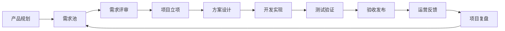
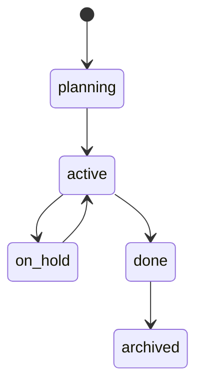
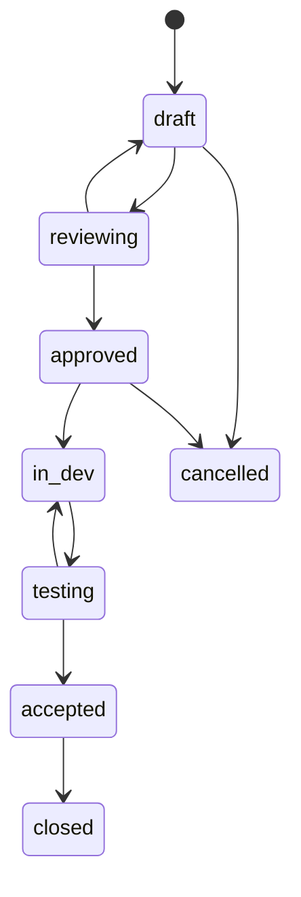
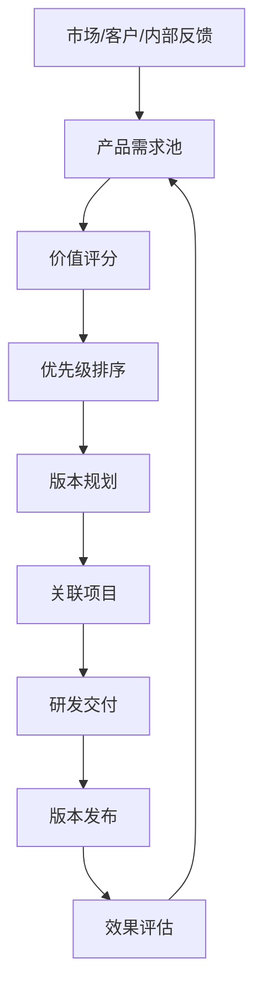
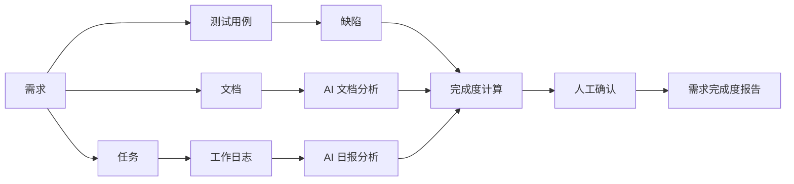

# 项目与产品流程设计

> **适用阶段**：全阶段。所有状态枚举以 [00 数据字典](./00-数据字典与术语统一.md) 为唯一真源，本文不再各自定义。可配置流程模板引擎（15 节点、门禁、审批）属**阶段三**；阶段一仅使用固定的 Scrum/Kanban 状态流。

## 1. 总体流程

平台通过“产品规划 -> 需求池 -> 项目立项 -> 开发交付 -> 测试验收 -> 发布运营 -> 复盘改进”的链路，把产品、项目、需求、任务、测试、文档和日志连接起来。

## 2. 项目状态流转

项目状态字段（`project.status`）统一为 [00 §2.4](./00-数据字典与术语统一.md) 的五态：`planning / active / on_hold / done / archived`。下图的中文 12 态（立项中/规划中/需求中等）属于**流程节点**（可配置流程模板的组成部分，阶段三），并非 `project.status` 的字段枚举，二者不要混用。

## 3. 需求状态流转

需求状态（`requirement.status`）统一为 [00 §2.3](./00-数据字典与术语统一.md) 的八态：`draft / reviewing / approved / in_dev / testing / accepted / closed / cancelled`。

## 4. 任务状态流转

任务状态（`task.status`）统一为 [00 §2.1](./00-数据字典与术语统一.md)：`todo / in_progress / blocked / code_review / testing / acceptance / done / cancelled`。**废弃**本文曾用的中文 8 态。

任务必须关联至少一个来源：

- 项目
- 需求
- 缺陷
- 文档

## 5. 开发流程节点说明（阶段三）

> **阶段归属**：可配置流程引擎（节点门禁、审批、输入输出校验）属**阶段三**。阶段一不实现流程引擎，仅使用 [00 §2.1](./00-数据字典与术语统一.md) 的固定任务状态流与 Scrum/Kanban。下表 11 节点作为流程模板的内置默认模板，供阶段三使用。

| 节点 | 输入 | 输出 | 负责人 | 质量门禁 |
| --- | --- | --- | --- | --- |
| 立项 | 项目申请、业务目标 | 立项单、项目章程 | 项目经理 | 目标、范围、负责人明确 |
| 需求分析 | 原始需求、标书、客户材料 | 需求规格说明、需求列表 | 产品经理 | 需求可验收、可追踪 |
| 需求评审 | 需求文档 | 评审记录、需求基线 | 产品经理 | 关键角色确认 |
| 方案设计 | 需求基线 | 概要设计、详细设计 | 架构师/技术负责人 | 模块、接口、数据清晰 |
| 开发排期 | 设计文档、需求列表 | 任务计划、里程碑 | 项目经理 | 资源和时间可执行 |
| 开发实现 | 任务计划 | 代码、接口、单元测试 | 开发人员 | 代码评审通过 |
| 联调 | 接口、环境、数据 | 联调记录 | 开发人员 | 主流程可跑通 |
| 测试验证 | 测试计划、用例 | 测试报告、缺陷列表 | 测试人员 | 阻塞缺陷关闭 |
| 验收 | 需求基线、测试报告 | 验收报告 | 业务/客户代表 | 验收标准达成 |
| 发布 | 发布包、上线计划 | 发布记录 | 运维/技术负责人 | 回滚方案完备 |
| 复盘 | 项目记录、问题清单 | 复盘报告、改进项 | 项目经理 | 改进项分配责任人 |

## 6. 产品集管理流程

## 7. 需求完成度闭环

需求完成度由平台自动计算，并允许项目经理或产品经理人工确认。

输入数据：

- 需求状态
- 关联任务完成情况
- 测试用例执行情况
- 缺陷关闭情况
- 文档完整性
- 每日工作日志
- 代码或发布记录

输出结果：

- 完成度百分比
- 已完成证据
- 未完成事项
- 风险项
- 下一步建议
- 可追溯引用

