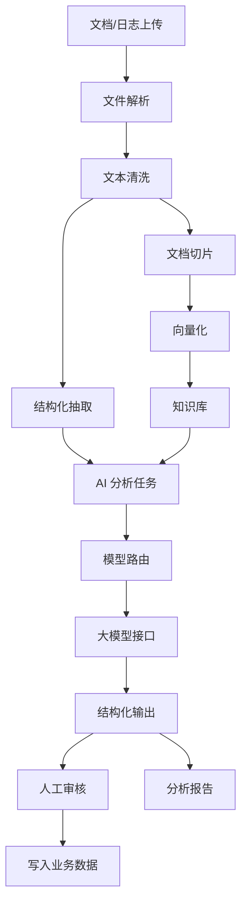
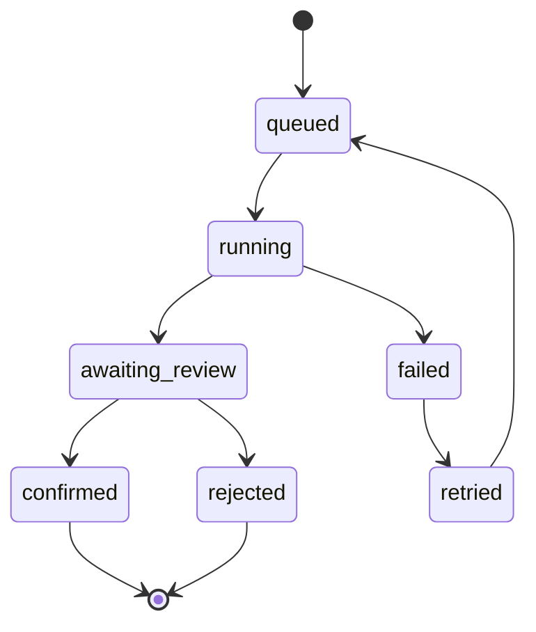

# AI 分析与模型接口方案

> **适用阶段**：全阶段。AI Job 状态机、日志输出 schema、完成度算法以 [00 数据字典](./00-数据字典与术语统一.md) 为准。
> 
> **场景阶段归属**：
> - **阶段一**：规则版日志分析 + 完成度建议 + 人工确认（§2.4、§6 基础算法）。
> - **阶段二**：文档分析（§2.1–§2.2）、RAG 检索（§8）、AI Job 全生命周期（§4.0/§4.4）。
> - **阶段三**：标书分析（§2.3）、自动规划（§2.5）、模型配置与多模型路由（§4.1–§4.2）、文档密级路由。

## 1. 建设目标

AI 分析中心用于自动理解设计文档、需求文档、标书、测试文档和个人每日工作日志，并将分析结果转化为可追踪的需求、任务、风险、计划和总结。

AI 能力必须满足三个原则：

- 可追溯：每个结论都能回到原始文档、日志或业务数据。
- 可审核：AI 生成内容进入正式业务数据前需要人工确认。
- 可配置：模型、Prompt、知识库、流程和输出模板可配置。

## 2. AI 使用场景

### 2.1 设计文档分析（阶段二）

输入：

- 概要设计文档
- 详细设计文档
- 接口文档
- 数据库设计
- 架构图说明

输出：

- 模块清单
- 接口清单
- 数据对象
- 依赖关系
- 风险点
- 缺失项
- 开发任务建议
- 测试关注点

### 2.2 需求文档分析（阶段二）

输入：

- 需求规格说明书
- 用户故事
- 客户访谈记录
- 会议纪要
- 原型说明

输出：

- 需求清单
- 需求优先级建议
- 验收标准
- 任务拆解
- 测试点
- 风险和依赖
- 工作量估算建议

### 2.3 标书分析（阶段三）

输入：

- 招标文件
- 技术规范书
- 商务条款
- 评分标准
- 附件清单

输出：

- 招标要求摘要
- 技术响应矩阵
- 商务响应矩阵
- 评分点识别
- 风险条款
- 交付计划建议
- 项目实施方案草稿
- 标书目录建议

### 2.4 每日工作日志分析

输入：

- 个人每日工作日志
- 附件
- 关联任务
- 关联需求
- 当日系统行为记录

输出：

- 今日完成事项
- 未完成事项
- 阻塞问题
- 关联需求
- 关联任务
- 风险预警
- 明日计划
- 需求完成度变化
- 个人工作总结

### 2.5 自动规划（阶段三）

输入：

- 需求列表
- 项目周期
- 团队成员
- 成员技能
- 历史工时
- 风险约束

输出：

- 里程碑建议
- 任务拆解
- 负责人建议
- 排期建议
- 风险提醒
- 关键路径

## 3. AI 架构



## 4. 模型接口设计

### 4.0 AI Job 状态机

AI 分析统一由 `ai_job` 驱动，前端不直接等待模型调用完成。



状态说明：

| 状态 | 说明 | 前端动作 |
| --- | --- | --- |
| queued | 已入队，等待 Worker 执行 | 展示排队中 |
| running | 正在解析、检索或调用模型 | 展示进度和阶段 |
| awaiting_review | 模型输出完成，等待人工审核 | 展示结构化结果和确认入口 |
| confirmed | 人工确认并写入业务数据 | 展示写入结果 |
| rejected | 人工驳回，不写入业务数据 | 展示驳回原因 |
| failed | 执行失败 | 展示错误和重试入口 |
| retried | 已创建重试任务 | 跳转到新 Job |

### 4.1 模型配置（阶段三）

字段：

- 模型供应商
- 模型名称
- API 地址
- API Key 密文
- 上下文长度
- 最大输出长度
- 温度参数
- 请求超时时间
- 并发限制
- 是否启用
- 适用场景

### 4.2 模型路由（阶段三）

路由策略：

- 文档摘要：使用高上下文模型。
- 结构化抽取：使用稳定输出模型。
- 规划排期：使用推理能力较强模型。
- 日志分析：使用低成本快速模型。
- 敏感文档：优先使用私有化模型。

### 4.3 统一调用接口

```http
POST /api/ai/analyze
Content-Type: application/json

{
  "scene": "requirement_analysis",
  "sourceType": "document",
  "sourceId": "doc_001",
  "projectId": "project_001",
  "productId": "product_001",
  "promptTemplateId": "tpl_requirement_v1",
  "outputSchema": "requirement_analysis_v1"
}
```

通用 Job 提交接口建议作为后端内部和高级前端入口，普通业务页面优先调用场景化接口。

```http
POST /api/ai/jobs
Content-Type: application/json

{
  "scene": "planning",
  "sourceType": "project",
  "sourceId": "project_001",
  "context": {
    "programId": "program_001",
    "portfolioId": "portfolio_001"
  },
  "goals": ["generate_wbs", "identify_risks", "estimate_schedule"]
}
```

返回：

```json
{
  "jobId": "job_202606230001",
  "status": "queued",
  "pollingUrl": "/api/ai/jobs/job_202606230001"
}
```

### 4.4 异步文档分析接口

文档分析建议采用异步 Job 模式，避免大文件解析、OCR、向量检索和大模型调用阻塞前端请求。

提交分析任务：

```http
POST /api/ai/documents/analyze
Content-Type: application/json

{
  "documentId": "doc_001",
  "fileUrl": "s3://project-docs/bid.docx",
  "type": "bid",
  "projectId": "project_001",
  "analysisGoals": ["extract_requirements", "generate_wbs", "risk_review"]
}
```

返回：

```json
{
  "jobId": "job_001",
  "status": "queued"
}
```

轮询任务：

```http
GET /api/ai/jobs/job_001
```

返回：

```json
{
  "jobId": "job_001",
  "status": "completed",
  "progress": 100,
  "result": {
    "summary": "识别出 18 条需求、6 个交付物、4 个里程碑和 5 个风险。",
    "requirements": [],
    "wbs": [],
    "risks": [],
    "responseMatrix": []
  }
}
```

确认写入：

```http
POST /api/ai/jobs/job_001/confirm
Content-Type: application/json

{
  "selectedItems": [
    {
      "type": "requirement",
      "tempId": "req_tmp_001",
      "action": "create"
    },
    {
      "type": "task",
      "tempId": "task_tmp_003",
      "action": "create"
    }
  ],
  "reviewComment": "确认导入一期登录模块需求和任务"
}
```

返回：

```json
{
  "jobId": "job_001",
  "status": "confirmed",
  "created": {
    "requirements": ["REQ-1021"],
    "tasks": ["TASK-431", "TASK-432"]
  }
}
```

### 4.5 工作日志分析接口

工作日志可以通过事件异步触发，也可以手动重试分析。同步返回的结果只用于快速预览；正式写入完成度时仍应生成 Job 并进入人工确认。

```http
POST /api/ai/logs/analyze
Content-Type: application/json

{
  "logId": "log_001",
  "userId": "user_001",
  "content": "完成 REQ-1021 登录接口开发，接口联调通过，测试还缺少异常场景。",
  "date": "2026-06-23"
}
```

日志分析输出统一使用 [00 §4](./00-数据字典与术语统一.md) 定义的 schema，包含 entities（NER，含 method/confidence）、progressUpdates、blockers、suggestedLinks、completionDelta、nextPlan、analysisId 和 jobId。本文不再单独定义，合并以下三个不一致的示例为一个标准结构。

日志 NER 结果应包含规则命中和模型判断两部分，便于后续训练和审计：

```json
{
  "analysisId": "analysis_001",
  "jobId": "job_001",
  "entities": [
    {
      "type": "requirement",
      "refCode": "REQ-1021",
      "method": "regex",
      "confidence": 0.99
    },
    {
      "type": "progress_signal",
      "value": "联调通过",
      "method": "llm",
      "confidence": 0.86
    }
  ],
  "progressUpdates": [
    {
      "targetType": "task",
      "targetId": "TASK-431",
      "deltaPercent": 90,
      "note": "登录接口开发完成，联调通过"
    }
  ],
  "blockers": [
    {
      "description": "缺少异常场景测试",
      "severity": "medium"
    }
  ],
  "suggestedLinks": [
    {
      "fromType": "log",
      "toType": "task",
      "toId": "TASK-431",
      "confidence": 0.86
    }
  ],
  "completionDelta": [
    {
      "requirementId": "REQ-1021",
      "suggestedScore": 90,
      "reason": "日志明确提到开发完成且接口联调通过，但测试异常场景未完成"
    }
  ],
  "nextPlan": ["补充登录接口异常场景测试用例"],
  "requiresReview": true
}
```

> 注意：本文历史版本曾在同一节内给出三组不同结构的示例（entities/suggestedLinks / extractedEntities/progressUpdates/suggestedActions / status/result/evidence），现已统一为 00 §4 的单一 schema。如有旧用例使用旧格式，请以 00 为准更新。

## 5. 结构化输出要求

AI 输出应尽量使用 JSON Schema 约束，避免纯文本难以落库。

需求分析输出：

```json
{
  "requirements": [
    {
      "title": "需求标题",
      "description": "需求描述",
      "priority": "high",
      "acceptanceCriteria": ["验收标准"],
      "dependencies": ["依赖项"],
      "risks": ["风险项"],
      "suggestedTasks": ["任务建议"],
      "evidenceRefs": ["证据引用"]
    }
  ]
}
```

日报分析输出：

```json
{
  "completedItems": [],
  "unfinishedItems": [],
  "blockers": [],
  "relatedRequirements": [],
  "relatedTasks": [],
  "completionDelta": [],
  "nextActions": [],
  "summary": ""
}
```

## 6. 需求完成度分析

完成度算法统一采用 [00 §5](./00-数据字典与术语统一.md) 的一个版本与硬规则：

```text
完成度 = 关联任务完成率×0.40 + 测试通过率×0.30 + 日志进度×0.20 + 人工确认×0.10 − 风险扣减
```

> 注意：本文历史版本曾同时给出”基础算法”和”增强算法”两个版本，现已统一为 00 §5 一条。硬规则（无测试≤80%、阻塞缺陷≤70%、差异>15% 报警、待验收+通过率<90% 禁止自动关闭）同样以 00 为准，本文不再单独定义。

## 7. 安全与审计

- 文档上传后进行权限校验。
- 敏感文档可设置禁止外部模型分析。
- API Key 加密存储。
- AI 请求和响应保留审计日志。
- AI 输出标识为“机器生成”，人工确认后再转为正式数据。
- 支持按项目、组织、文档密级限制 AI 分析范围。

## 8. RAG 与日志 NER

> **阶段归属**：RAG 向量检索与文档切片属**阶段二**；日志 NER 规则版（正则+词典+LLM 判断）属**阶段一**。

### 8.1 RAG 文档分析

文档分析应接入企业知识库：

- 历史需求文档
- 历史设计文档
- 历史标书
- 历史测试报告
- 项目复盘报告

处理流程：

1. 文档解析为文本和结构化段落。
2. 按标题、章节、表格、页码切片。
3. 写入向量数据库。
4. 分析新文档时检索相似资料。
5. 将相似案例作为上下文提供给模型。
6. 输出结构化结果和证据引用。

RAG 检索接口：

```http
POST /api/ai/rag/search
Content-Type: application/json

{
  "query": "登录接口验收标准和异常场景",
  "scope": {
    "projectId": "project_001",
    "portfolioId": "portfolio_001",
    "securityLevelMax": "internal"
  },
  "topK": 5
}
```

返回：

```json
{
  "matches": [
    {
      "chunkId": "chunk_001",
      "documentId": "doc_001",
      "title": "登录模块详细设计",
      "score": 0.87,
      "quote": "登录失败需覆盖密码错误、账号锁定、验证码失效等异常场景。"
    }
  ]
}
```

建议落库对象：

| 对象 | 说明 |
| --- | --- |
| `document_chunk` | 文档切片，记录章节、页码、标题、文本和安全级别 |
| `embedding_index` | 向量索引元数据，记录模型、维度、索引状态 |
| `rag_citation` | 分析结果引用的切片和原文证据 |
| `prompt_template` | 场景化 Prompt 模板和输出 Schema |

### 8.2 工作日志 NER

日志分析应识别：

- 需求编号，例如 `REQ-1021`。
- 任务编号，例如 `TASK-431`。
- 缺陷编号，例如 `BUG-118`。
- 模块名称。
- 动作状态，例如完成、部分完成、阻塞、等待、修复、验证。
- 进度表达，例如 60%、基本完成、联调通过、测试未通过。

后续可基于人工标注的日志数据训练专用模型；MVP 阶段可先使用规则抽取 + LLM 结构化判断。

NER 处理规则：

- 先用正则识别 `REQ-*`、`TASK-*`、`BUG-*`、百分比和日期表达。
- 再用业务词典识别产品、模块、接口、流程节点和常见动作。
- 最后由 LLM 判断进度含义、阻塞原因、下一步动作和置信度。
- 置信度低于 0.75 的实体只作为建议，不自动关联业务对象。
- 人工确认后的实体样本写入训练集，支持后续专用模型训练。

## 9. 错误处理与审计

AI 接口统一错误格式：

```json
{
  "errorCode": "AI_MODEL_TIMEOUT",
  "message": "模型调用超时",
  "jobId": "job_001",
  "retryable": true,
  "traceId": "trace_202606230001"
}
```

常见错误码：

| 错误码 | 含义 | 处理方式 |
| --- | --- | --- |
| `AI_PERMISSION_DENIED` | 无权分析该文档或业务对象 | 前端提示权限不足 |
| `AI_FILE_PARSE_FAILED` | 文件解析失败 | 提示重新上传或转为文本 |
| `AI_RAG_INDEX_MISSING` | 文档尚未完成向量索引 | 等待索引或降级为无 RAG 分析 |
| `AI_MODEL_TIMEOUT` | 模型调用超时 | 允许重试 |
| `AI_SCHEMA_INVALID` | 模型输出不符合 Schema | 后端自动修复或转人工处理 |

审计要求：

- 记录 Job 创建人、输入来源、模型路由、Prompt 模板版本和输出 Schema。
- 记录模型请求摘要，不在普通日志中存储 API Key 和敏感原文。
- 记录人工确认、编辑、驳回和写入业务数据的差异。
