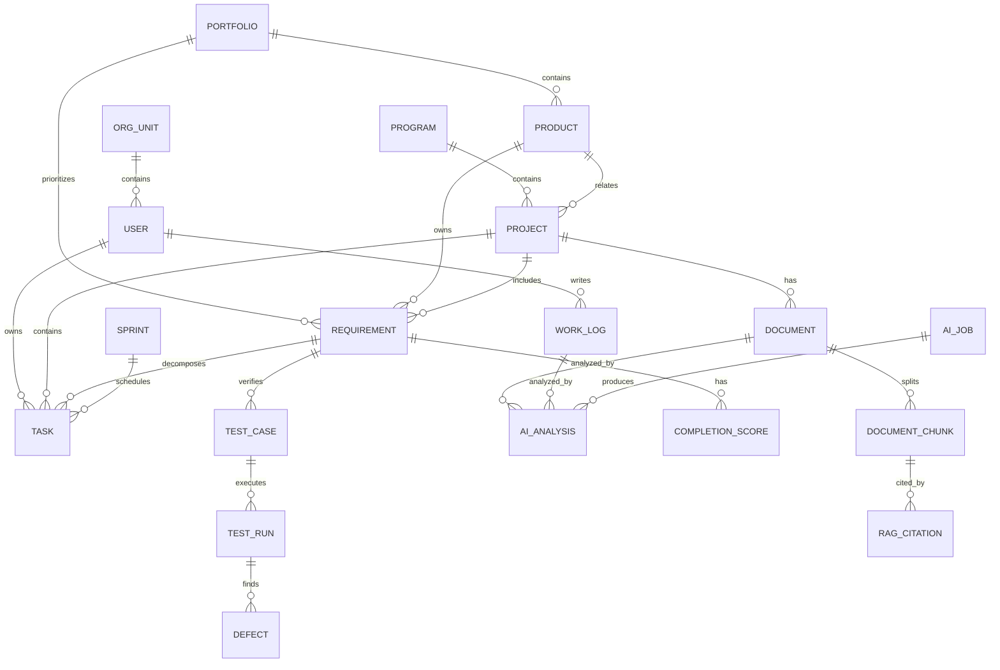

# 数据模型与权限设计

> **适用阶段**：全阶段（目标态数据模型）。所有状态枚举、字段命名以 [00 数据字典](./00-数据字典与术语统一.md) 为唯一真源；本文示例若与 00 冲突，以 00 为准。
> **文档基线**：本文同时保留**目标态模型**与**当前实际实现模型**。当前实现以 [§2.15 实际数据库 Schema（as-built）](#215-实际数据库-schemaas-built以此为准) 为准；目标态表（如 `ai_analysis`、`document_chunk`、`test_run`）未实现时不应作为联调依据。差异台账见 [10 实现状态与差异清单](./10-实现状态与差异清单.md)。
>
> **表的阶段归属**：
> - **阶段一核心表**：user、org_unit、project、requirement、task、sprint、kanban_column、defect、test_case、test_run、work_log、document、completion_score、audit_log。
> - **阶段二**：ai_job、ai_analysis、document_chunk、rag_citation（AI 文档闭环 + RAG）。
> - **阶段三**：program、portfolio、product（战略层）、workflow 流程引擎相关表、细粒度权限相关表。
> - program_id / portfolio_id / product_id 等外键在阶段一即保留，但仅作可选分组字段，不提供独立管理域。

## 1. 核心实体



## 2. 主要数据表

### 2.1 用户 user

| 字段 | 类型 | 说明 |
| --- | --- | --- |
| id | string | 用户 ID |
| name | string | 姓名 |
| account | string | 登录账号 |
| email | string | 邮箱 |
| org_id | string | 所属组织 |
| title | string | 岗位 |
| status | string | 状态 |
| created_at | datetime | 创建时间 |

### 2.2 组织 org_unit

| 字段 | 类型 | 说明 |
| --- | --- | --- |
| id | string | 组织 ID |
| parent_id | string | 上级组织 |
| name | string | 组织名称 |
| type | string | 公司、部门、团队、项目组 |
| manager_id | string | 负责人 |

### 2.3 项目 project

| 字段 | 类型 | 说明 |
| --- | --- | --- |
| id | string | 项目 ID |
| name | string | 项目名称 |
| code | string | 项目编号 |
| status | string | 项目状态 |
| manager_id | string | 项目经理 |
| program_id | string | 所属项目集 |
| product_id | string | 关联产品 |
| start_date | date | 开始时间 |
| end_date | date | 结束时间 |
| health_score | number | 健康度 |
| process_mode | string | waterfall、scrum、kanban、hybrid |
| workflow_template_id | string | 流程模板 ID |

### 2.3.1 项目集 program

| 字段 | 类型 | 说明 |
| --- | --- | --- |
| id | string | 项目集 ID |
| name | string | 项目集名称 |
| description | text | 描述 |
| owner_id | string | 负责人 |
| health_score | number | 整体健康度 |
| progress | number | 汇总进度 |
| status | string | 状态 |
| start_date | date | 开始时间 |
| end_date | date | 结束时间 |

### 2.3.2 产品集 portfolio

| 字段 | 类型 | 说明 |
| --- | --- | --- |
| id | string | 产品集 ID |
| name | string | 产品集名称 |
| owner_id | string | 负责人 |
| strategy | text | 产品策略 |
| status | string | 状态 |
| planning_horizon | string | 年度、季度、月度 |

### 2.4 产品 product

| 字段 | 类型 | 说明 |
| --- | --- | --- |
| id | string | 产品 ID |
| parent_id | string | 上级产品或产品线 |
| portfolio_id | string | 所属产品集 |
| name | string | 产品名称 |
| owner_id | string | 产品负责人 |
| version | string | 当前版本 |
| status | string | 状态 |

### 2.5 需求 requirement

| 字段 | 类型 | 说明 |
| --- | --- | --- |
| id | string | 需求 ID |
| title | string | 需求标题 |
| description | text | 需求描述 |
| status | string | 需求状态 |
| priority | string | 优先级 |
| product_id | string | 关联产品 |
| portfolio_id | string | 需求池所属产品集 |
| project_id | string | 关联项目 |
| owner_id | string | 负责人 |
| acceptance_criteria | json | 验收标准 |
| completion_score | number | 完成度 |
| source_type | string | manual、document_ai、bid_ai、import |
| value_score | number | 业务价值评分 |

### 2.6 任务 task

| 字段 | 类型 | 说明 |
| --- | --- | --- |
| id | string | 任务 ID |
| title | string | 任务标题 |
| status | string | 任务状态 |
| assignee_id | string | 负责人 |
| project_id | string | 项目 ID |
| requirement_id | string | 需求 ID |
| due_date | date | 截止时间 |
| progress | number | 进度 |
| blocker | text | 阻塞原因 |
| parent_id | string | 父任务 ID，用于 WBS |
| type | string | epic、story、task、bug、milestone、work_package |
| estimated_hours | number | 预估工时 |
| actual_hours | number | 实际工时 |
| sprint_id | string | 所属迭代 |
| kanban_column | string | 看板列 |
| wbs_code | string | WBS 编号，例如 1.2.3 |
| sort_order | number | 同级排序 |
| dependency_ids | json | 前置任务 ID 列表 |

### 2.6.1 迭代 sprint

| 字段 | 类型 | 说明 |
| --- | --- | --- |
| id | string | 迭代 ID |
| project_id | string | 项目 ID |
| name | string | 迭代名称 |
| goal | text | 迭代目标 |
| start_date | date | 开始时间 |
| end_date | date | 结束时间 |
| status | string | planned、active、closed |

### 2.6.1.1 看板列 kanban_column

| 字段 | 类型 | 说明 |
| --- | --- | --- |
| id | string | 看板列 ID |
| project_id | string | 项目 ID |
| name | string | 列名称 |
| status_mapping | string | 映射任务状态 |
| wip_limit | number | 在制品限制 |
| sort_order | number | 排序 |

### 2.6.2 缺陷 defect

| 字段 | 类型 | 说明 |
| --- | --- | --- |
| id | string | 缺陷 ID |
| title | string | 缺陷标题 |
| severity | string | 严重级别 |
| status | string | 缺陷状态，见 [00 §2.2](./00-数据字典与术语统一.md)：`new / confirmed / in_fix / resolved / verified / closed` |
| project_id | string | 项目 ID |
| requirement_id | string | 关联需求 |
| test_run_id | string | 关联测试执行 |
| assignee_id | string | 负责人 |

### 2.7 工作日志 work_log

| 字段 | 类型 | 说明 |
| --- | --- | --- |
| id | string | 日志 ID |
| user_id | string | 用户 |
| log_date | date | 日期 |
| content | text | 日志正文 |
| attachments | json | 附件 |
| ai_summary | text | AI 总结 |
| status | string | 草稿、已提交、已分析、已确认 |

### 2.8 文档 document

| 字段 | 类型 | 说明 |
| --- | --- | --- |
| id | string | 文档 ID |
| title | string | 文档标题 |
| type | string | 文档类型 |
| project_id | string | 项目 ID |
| product_id | string | 产品 ID |
| requirement_id | string | 需求 ID |
| file_url | string | 文件地址 |
| version | string | 版本 |
| security_level | string | 密级 |

### 2.9 AI 分析任务 ai_analysis

| 字段 | 类型 | 说明 |
| --- | --- | --- |
| id | string | AI 任务 ID |
| scene | string | 分析场景 |
| source_type | string | 来源类型 |
| source_id | string | 来源 ID |
| status | string | 任务状态 |
| model_name | string | 模型名称 |
| result | json | 分析结果 |
| evidence | json | 证据引用 |
| confidence | number | 置信度 |
| reviewed_by | string | 审核人 |
| review_status | string | pending、confirmed、rejected |
| reviewed_at | datetime | 审核时间 |

### 2.10 AI 异步任务 ai_job

| 字段 | 类型 | 说明 |
| --- | --- | --- |
| id | string | AI Job ID |
| scene | string | document_analysis、log_analysis、planning、completion_score |
| source_type | string | document、work_log、requirement、project |
| source_id | string | 来源 ID |
| status | string | AI Job 状态，见 [00 §2.5](./00-数据字典与术语统一.md)：`queued / running / awaiting_review / confirmed / rejected / failed / retried` |
| progress | number | 进度 |
| model_route | string | 模型路由策略 |
| request_payload | json | 请求参数 |
| result_payload | json | 分析结果 |
| error_message | text | 错误信息 |
| created_by | string | 创建人 |
| created_at | datetime | 创建时间 |
| completed_at | datetime | 完成时间 |

### 2.11 文档切片 document_chunk

| 字段 | 类型 | 说明 |
| --- | --- | --- |
| id | string | 切片 ID |
| document_id | string | 文档 ID |
| chunk_index | number | 切片序号 |
| heading | string | 所属标题 |
| page_no | number | 页码 |
| content | text | 切片文本 |
| token_count | number | Token 数 |
| security_level | string | 继承或覆盖文档密级 |
| embedding_status | string | pending、indexed、failed |

### 2.12 RAG 引用 rag_citation

| 字段 | 类型 | 说明 |
| --- | --- | --- |
| id | string | 引用 ID |
| ai_analysis_id | string | AI 分析 ID |
| chunk_id | string | 文档切片 ID |
| quote | text | 原文片段 |
| relevance_score | number | 相似度或相关度 |
| created_at | datetime | 创建时间 |

### 2.13 需求完成度 completion_score

| 字段 | 类型 | 说明 |
| --- | --- | --- |
| id | string | 完成度记录 ID |
| requirement_id | string | 需求 ID |
| task_score | number | 任务维度得分 |
| test_score | number | 测试维度得分 |
| document_score | number | 文档维度得分 |
| log_score | number | 日志维度得分 |
| risk_deduction | number | 风险扣减 |
| total_score | number | 总分 |
| evidence | json | 证据引用 |
| source | string | system、ai、manual |
| confirmed_by | string | 确认人 |
| confirmed_at | datetime | 确认时间 |

## 2.14 实际数据库 Schema（as-built，以此为准）

> 来源：`api/db.js`（2026-06-24）。当前后端使用 **SQLite（`node:sqlite` DatabaseSync）**，数据库文件为 `api/app.db`，启用 WAL。所有表均为 `CREATE TABLE IF NOT EXISTS`，**没有显式 FOREIGN KEY 约束**；关系仅通过 TEXT id 字段在业务层逻辑关联。

### 2.14.1 实际表清单

| 表 | 当前字段摘要 | 说明 |
| --- | --- | --- |
| `users` | `id/name/email/password_hash/role/permissions/created_at` | 仅种子 admin/pm 两个登录用户；`permissions` 为 JSON 字符串 |
| `programs` | `id/name/owner/status/health_score/progress/project_ids/risks/updated_at` | 阶段三域，但当前已有只读列表 |
| `portfolios` | `id/name/owner/status/product_ids/roadmap` | 阶段三域，只读 |
| `projects` | `id/name/status/health_score/owner/program_id/product_id/process_mode/progress/risk_count/milestones/updated_at` | `milestones` 为 JSON 字符串 |
| `products` | `id/name/owner/version/stage/modules/roadmap` | 阶段三域，只读 |
| `requirements` | `id/title/description/status/priority/project_id/product_id/portfolio_id/owner/completion/linked_tasks/acceptance_criteria` | `linked_tasks`、`acceptance_criteria` 为 JSON 字符串 |
| `tasks` | `id/title/status/status_text/project_id/owner/due_date/requirement_id/progress/blocker/type/parent_id/wbs_code/kanban_column/sort_order/estimated_hours/actual_hours` | 无 `sprint_id`、无 `dependency_ids`、无 `assignee_id`；负责人是 `owner` 字符串 |
| `test_cases` | `id/name/requirement_id/project_id/status/owner/total_cases/passed_cases/failed_cases/blocked_cases/description/steps/expected_result` | 同时支撑 `/api/test-cases` 与 `/api/tests` 两套路由 |
| `documents` | `id/title/type/version/ai_status/owner/updated_at/linked_requirements/risks/file_name/file_size/file_type/storage_key/content` | 文件内容可存 DB `content`，也可通过 `storage_key` 指向本地文件 |
| `objects` | `id/bucket/storage_key/original_name/mime_type/size/created_by/created_at` | 本地对象存储索引表 |
| `work_logs` | `id/author/project/content/blockers/next_plan/analysis/created_at` | `project` 是自由文本，不是项目 ID 外键 |
| `ai_jobs` | `job_id/scene/status/progress/current_step/source_type/source_id/goals/result/evidence/written_requirement_id/created_at/confirmed_at` | 当前仅落地 document_analysis 的 awaiting_review→confirmed |
| `sprints` | `id/project_id/name/goal/status/start_date/end_date` | 无任务关联字段；任务表也无 `sprint_id` |
| `defects` | `id/title/severity/status/project_id/requirement_id/assignee` | `assignee` 为字符串 |
| `audit_logs` | `id/actor_id/actor_name/action/resource_type/resource_id/before_json/after_json/ip/created_at` | 写操作大多记录审计 |

### 2.14.2 兼容迁移

`db.js` 在建表后对旧库执行 3 条幂等 `ALTER TABLE`（错误吞掉）：

- `test_cases ADD COLUMN description TEXT DEFAULT ''`
- `test_cases ADD COLUMN steps TEXT DEFAULT ''`
- `test_cases ADD COLUMN expected_result TEXT DEFAULT ''`

### 2.14.3 目标态未落地表

以下表在目标态模型中出现，但当前数据库**未实现**，不得作为联调依据：

| 目标态表 | 当前替代/状态 |
| --- | --- |
| `org_unit` | `data.js` 中静态 `organization` 对象，经 `GET /api/org` 返回；非数据库表 |
| `test_run` | 未实现；测试执行以 `test_cases` 的 passed/failed/blocked 计数粗略表示 |
| `kanban_column` | 不落表；看板列 = `task.status/kanban_column` 枚举映射 |
| `completion_score` | 不落表；`GET /api/requirements/{id}/completion-score` 实时计算 |
| `ai_analysis` | 未实现；AI 结果直接存在 `ai_jobs.result/evidence` |
| `document_chunk` / `rag_citation` | 未实现；无 RAG/向量库 |
| `product_modules` | 未实现；产品模块存在 `products.modules` JSON 字段中 |
| 细粒度权限表 | 未实现；仅 `users.permissions` JSON 字符串 |

### 2.14.4 关键差异提醒

- `users` 表与 `organization.people` 是**两套人员数据**：前者用于登录，后者用于组织只读展示，二者无 ID 关联。
- `users` 表已支持 CRUD（`GET/POST/PATCH/DELETE /api/users`，`admin:*` 权限），禁用用户鉴权拦截（登录/已登录请求/WebSocket 均 403）。`organization.people` 仍为静态只读展示数据，与 `users` 无 ID 关联。
- 任务与 Sprint **未真正关联**：`sprints` 有表，任务表无 `sprint_id`；`GET /api/projects/{id}` 返回 tasks/sprints 但不是多对一关联。
- `test_cases` 被 `/api/test-cases` 与 `/api/tests` 共用，字段命名不同（`title` vs `name`），建议后续收敛。
- 数据库无 FK 约束，删除/更新一致性依赖业务代码手工处理。

## 2.15 状态枚举

所有状态枚举的文档真源为 [00 数据字典 §2](./00-数据字典与术语统一.md)。**当前代码尚未提供枚举下发接口，前后端仍存在页面/端点内的局部枚举副本**；具体差异见 [10 §4](./10-实现状态与差异清单.md)。摘要：

| 对象 | 真源 |
| --- | --- |
| Project | 00 §2.4：`planning / active / on_hold / done / archived` |
| Requirement | 00 §2.3：`draft / reviewing / approved / in_dev / testing / accepted / closed / cancelled` |
| Task | 00 §2.1：`todo / in_progress / blocked / code_review / testing / acceptance / done / cancelled` |
| Sprint | `planned / active / closed` |
| Defect | 00 §2.2：`new / confirmed / in_fix / resolved / verified / closed` |
| AI Job | 00 §2.5：`queued / running / awaiting_review / confirmed / rejected / failed / retried` |

> 注：原文 Project 12 态、Requirement `confirmed/scheduled/developing/released` 等写法已废弃，统一改用上表（细分阶段属流程节点，不是项目/需求状态字段）。

## 3. 权限模型

> **阶段归属**：**阶段一仅实现简化 RBAC**（角色 + 资源粒度权限，见 [00 §7](./00-数据字典与术语统一.md)）。下文的数据范围（§3.2）、文档密级（§3.3）及 5 步叠加判断属**阶段三**。
>
> **实际实现（as-built）**：后端当前通过 JWT + `users.permissions` JSON 字符串实现简化权限：`*` 表示超级权限；`resource:*` 表示资源通配；`resource:action` 表示精确权限。种子用户仅两个：`admin`（`*`）与 `pm`（`project:*`、`requirement:*`、`document:*`、`ai:*`、`audit:read`）。除 `/api/health`、`/api/auth/login` 外全部端点需 Bearer token；写操作使用 `requirePermission(...)` 校验。数据范围、文档密级、菜单权限、账号状态等未落地。

目标态采用 RBAC + 数据权限 + 文档密级组合。

权限判断顺序（阶段三完整态）：

1. 校验用户是否登录、账号是否启用。
2. 校验菜单和操作权限，例如查看、编辑、审批、分析、导出。
3. 校验数据范围，例如本人、本部门、所属项目、所属产品线、全公司。
4. 校验文档密级和 AI 模型使用策略。
5. 校验对象状态是否允许当前操作，例如已归档项目不允许新增任务。

### 3.1 RBAC

角色控制用户能看到哪些菜单、执行哪些操作。

基础权限：

- 查看
- 新增
- 编辑
- 删除
- 审批
- 导入
- 导出
- 分析
- 确认 AI 结果

### 3.2 数据权限

数据范围：

- 本人
- 本部门
- 下级部门
- 所属项目
- 所属产品线
- 全公司
- 自定义范围

### 3.3 文档密级

文档密级：

- 公开
- 内部
- 项目内
- 部门内
- 机密
- 严格机密

AI 分析权限应与文档密级绑定。机密文档默认只能使用私有化模型或本地模型。

### 3.4 关键权限点

| 操作 | 权限点 | 数据范围 |
| --- | --- | --- |
| 查看 Program | `program:read` | 所属项目集、下级部门、全公司 |
| 编辑 Portfolio | `portfolio:update` | 所属产品线、全公司 |
| 创建 WBS 任务 | `task:create` | 所属项目 |
| 移动 Kanban 卡片 | `task:update_status` | 所属项目或任务负责人 |
| 确认 AI 结果 | `ai:confirm` | 结果来源对象的管理权限 |
| 分析机密文档 | `ai:analyze_secret` | 文档密级授权 + 私有模型 |

## 4. 审计日志

必须记录：

- 用户登录
- 权限变更
- 项目状态变更
- 需求状态变更
- 文档上传和下载
- AI 分析请求
- AI 分析结果查看
- AI 结果人工确认
- 数据导出

审计字段：

- 操作人
- 操作时间
- 操作对象
- 操作类型
- 操作前数据
- 操作后数据
- IP 地址
- 设备信息

## 5. API 返回模型约定

当前后端统一使用成功信封 `{ data, meta }`（无 `success` 字段），错误响应不带信封。详见 [00 §6](./00-数据字典与术语统一.md) 与 [09 §2](./09-接口清单与开发任务拆分.md)。

列表接口：

- 若请求带 `page` + `pageSize`，`data` 为分页对象：

```json
{
  "data": {
    "items": [],
    "page": 1,
    "pageSize": 20,
    "total": 0
  },
  "meta": { "generatedAt": "2026-06-24T08:00:00Z" }
}
```

- 若不带分页参数，`data` 直接为数组：

```json
{
  "data": [],
  "meta": { "generatedAt": "2026-06-24T08:00:00Z" }
}
```

详情接口统一返回业务对象本身并包在 `data` 内，关联对象按场景显式展开，例如 Project 详情当前包含 `tasks` 与 `sprints`。

错误接口统一返回：

```json
{
  "errorCode": "PERMISSION_DENIED",
  "message": "无权访问该项目",
  "traceId": "uuid"
}
```
