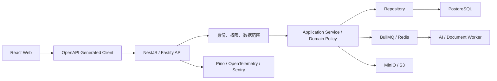

# 项目管理平台统一优化设计方案

> 文档状态：统一设计稿  
> 编制日期：2026-07-13  
> 适用范围：公司项目管理平台前端、后端、数据、权限、研发工作流、团队容量及 AI 能力  
> 设计依据：当前代码全面 Review、现有架构重构计划、项目管理流程设计、闭环操作设计及团队工作量合理性分析

## 1. 文档目的

本文将当前项目 Review 结论、技术架构优化方案、互联网研发项目管理方法和团队容量管理方案统一为一版可实施设计，作为后续需求拆分、架构演进、数据库升级和验收的共同基线。

本文重点解决以下问题：

1. 当前系统作为原型可以运行，但尚未达到生产级平台要求。
2. 前端、能力接口和后端权限存在契约不一致。
3. 业务状态只校验枚举，没有形成统一、可审计的状态机。
4. 项目、需求、任务、测试、构建和发布之间的数据关联缺少强约束。
5. 当前人员、任务、工时和日报数据不足以支持可靠的员工工作量评价。
6. 当前模块化重构以“拆文件”为主，尚未形成稳定的 Controller、Service、Policy、Repository 分层。
7. 设计文档与实际代码存在时间差，需要重新建立唯一真源。

## 2. 总体结论与产品定位

### 2.1 当前系统结论

当前系统适合作为“项目交付跟踪和内部试点平台”继续演进，尚不适合直接作为生产级项目治理平台，也不应直接用于员工绩效、晋升或薪酬评价。

当前已具备较完整的领域雏形：

- 产品、项目、需求、任务、Sprint、WBS 和看板。
- 测试用例、测试执行、缺陷、构建、发布、审批和回滚。
- 文档、工作日志、审计、权限和 AI 分析。
- React 前端、Express API、SQLite 持久化和本地文件存储。
- 发布门禁能够检查需求、任务、测试和缺陷的部分闭环状态。

主要不足在于：

- 数据可信度、权限范围、状态规则和工程质量尚未形成生产保障。
- 业务域铺得较宽，但核心日常工作流没有完全收敛。
- 工作量只能反映“系统里登记了什么”，不能准确反映有效容量、隐性工作和业务贡献。

### 2.2 统一产品定位

平台统一定位为：

> 面向互联网研发团队的“项目交付、团队容量与风险管理平台”。

平台优先回答三个问题：

1. 项目是否围绕明确目标按计划交付。
2. 团队资源是否合理分配，是否存在持续过载和资源冲突。
3. 哪些需求、依赖、质量或交付风险需要管理者介入。

平台必须严格区分：

| 领域 | 核心问题 | 平台职责 |
| --- | --- | --- |
| 项目管理 | 事情是否按目标和计划交付 | 提供计划、执行、质量、发布和复盘闭环 |
| 容量管理 | 人员是否被合理分配、是否过载 | 提供容量、投入比例、WIP 和风险提示 |
| 绩效评价 | 个人产生了什么价值和影响 | 仅提供事实证据，不自动给出绩效结论 |

## 3. Review 发现与优先级

### 3.1 必须优先修复的问题

| 优先级 | 问题 | 影响 | 统一处置方向 |
| --- | --- | --- | --- |
| P0 | 服务启动时覆盖内置账号权限和 `active` 状态 | 禁用或收回权限后可能被重启恢复 | 种子数据仅允许首次初始化，不覆盖已有账号 |
| P0 | 日报作者可由请求体指定 | 可冒用他人身份，审计和工作量数据失真 | 作者只允许取登录用户 ID |
| P1 | 前端 capability 声明允许 `projects:update`，后端项目/任务更新仍要求 `project:*` | 开发角色看到可操作按钮但实际返回 403 | 权限契约由后端统一定义并自动生成前端能力 |
| P1 | 项目、任务、需求等读取缺少项目成员数据范围 | 登录用户可能看到不属于自己的数据 | 增加统一项目范围 Policy 和查询过滤器 |
| P1 | 状态可跨阶段跳转 | 可绕过评审、测试、验收等门禁 | 建立统一状态机和状态历史 |
| P1 | 删除项目或需求可能留下孤儿数据 | 数据关系失真，报表和门禁结果不可信 | 默认软删除，物理清理使用事务和关系约束 |
| P1 | AI Key 明文保存在 SQLite | 密钥泄漏风险 | 使用环境密钥、密钥服务或加密存储 |
| P2 | 后端入口文件、前端页面体积过大 | 修改风险高，难以独立测试和迭代 | 按垂直业务模块拆分并建立明确分层 |
| P2 | SQLite 无外键、索引和版本化 migration | 难以扩展和恢复 | 迁移 PostgreSQL，使用正式 migration |
| P2 | 无单元测试、API 集成测试和 CI | 重构缺少回归保障 | 建立分层测试和持续集成门禁 |
| P2 | 文档与代码状态不一致 | 规划和联调依据不可靠 | OpenAPI、权限矩阵、状态机和数据模型建立唯一真源 |

### 3.2 当前合理且应保留的设计

- React、TypeScript、Vite 适合当前前端规模，应继续保留。
- REST API 和 `{ data, meta }` 成功响应格式可以在迁移期保持兼容。
- 当前按 feature 拆分前端 API 的方向正确。
- 后端按领域提取 router 的方向正确，但下一步应继续提取 Service 和 Repository。
- 发布前检查需求、任务、测试和缺陷的门禁思想正确，应扩展到其他状态流。
- AI 结果需要人工确认后写入正式业务数据的原则应继续保留。

## 4. 设计原则

### 4.1 模块化单体优先

当前阶段采用模块化单体，不拆微服务。现阶段主要矛盾是边界、契约和数据一致性，而不是单机吞吐能力。

只有满足以下条件时，才考虑独立拆出服务：

- AI、文档解析或通知任务已经形成独立的异步负载。
- 模块具有独立扩缩容、独立发布或强隔离需求。
- 已有稳定 API 契约、监控、追踪和故障处理能力。

### 4.2 契约驱动

以下内容必须建立唯一真源：

- API 路径、请求和响应类型。
- 状态枚举和允许的状态迁移。
- 权限点、角色和项目数据范围。
- 错误码。
- 分页、筛选和排序约定。

前端不再手工复制后端枚举和角色页面表，统一从 OpenAPI 和 capability 接口生成或读取。

### 4.3 服务端数据与客户端状态分离

- 项目、需求、任务、测试等服务端数据由 TanStack Query 管理。
- 主题、布局、未提交草稿等客户端状态由 Zustand 或组件本地状态管理。
- 不使用全局 store 重复保存服务端查询结果。
- 不使用全局清空缓存代替精确缓存失效。

### 4.4 工作量不等于绩效

- 工时、任务数和提交数不能直接等价为贡献。
- 默认以团队和项目为单位评估流动效率和可预测性。
- 个人指标只用于负载平衡、风险发现和工作支持。
- AI 不得自动生成员工绩效等级、排名、奖金或淘汰建议。

## 5. 目标业务架构


目标业务域划分如下：

| 业务中心 | 主要能力 |
| --- | --- |
| 目标与规划 | OKR、产品路线图、项目组合、需求价值和优先级 |
| 项目交付 | 项目、成员、里程碑、需求、Sprint、WBS、任务、风险和依赖 |
| 质量与发布 | 测试、测试执行、缺陷、构建、审批、发布、事故和回滚 |
| 团队与容量 | 工作日历、人员容量、项目投入、负载和资源冲突 |
| 知识与智能 | 文档、复盘、AI 分析、证据和人工确认 |
| 数据与治理 | 报表、审计、权限、配置、数据质量和集成管理 |

## 6. 信息架构与导航

建议将当前导航收敛为以下结构：

```text
我的工作
├── 个人工作台
├── 我的任务
├── 我的迭代
├── 我的负载
└── 工作记录

目标与规划
├── 公司目标
├── 产品路线图
├── 需求池
└── 项目组合

项目交付
├── 项目
├── 迭代
├── 需求
├── 任务/WBS
└── 风险与依赖

质量与发布
├── 测试
├── 缺陷
├── 构建
├── 发布
└── 事故与回滚

团队与资源
├── 团队容量
├── 项目投入
├── 负载分析
├── 值班与支持
└── 资源冲突

知识与智能
├── 文档
├── AI 分析
└── 复盘记录

管理设置
├── 组织与人员
├── 角色权限
├── 流程模板
├── 集成配置
└── 审计日志
```

不同角色默认进入不同工作台：

- 员工：个人任务、当前负载、阻塞和待处理事项。
- 项目经理：项目健康、里程碑、团队负载和依赖风险。
- 产品经理：需求池、价值排序、验收和目标效果。
- 测试负责人：测试覆盖、缺陷趋势和发布风险。
- 管理者：项目组合、资源冲突和团队容量趋势。

## 7. 项目管理工作流

### 7.1 项目立项

项目必须关联：

- 业务目标或产品目标。
- 项目负责人和项目成员。
- 计划开始、结束时间。
- 里程碑或首个迭代。
- 成功指标。
- 主要风险。
- 计划投入和资源来源。
- 交付方式：Scrum、Kanban 或里程碑。

项目状态建议为：

```text
draft → reviewing → approved → active → done → archived
                         ↘ on_hold ↗
```

项目进入 `active` 前必须满足：

- 目标和负责人明确。
- 核心成员已加入。
- 首个里程碑或迭代已建立。
- 高风险项已有责任人。
- 计划投入未超过团队有效容量，或已有明确超配审批。

### 7.2 需求管理

需求增加以下关键信息：

- 来源：客户、市场、内部、缺陷、合规。
- 关联目标、产品和项目。
- 用户价值、紧急度、成本和风险。
- 验收标准。
- 目标版本和需求负责人。
- 需求变更历史。

需求优先级可以使用可配置的辅助评分：

```text
需求建议优先级 = 业务价值 × 战略匹配度 × 紧急度 ÷ 成本与风险
```

评分只提供排序建议，由产品负责人最终确认。

需求状态建议为：

```text
draft
→ reviewing
→ approved
→ in_dev
→ testing
→ accepted
→ closed
```

系统必须阻止跨阶段跳转。例如草稿需求不能直接进入验收状态。

### 7.3 迭代管理

Sprint 开始前执行：

1. 计算团队和成员有效容量。
2. 扣除会议、培训、值班、支持和其他项目投入。
3. 选择候选需求并拆分任务。
4. 确认负责人、估算、依赖和验收条件。
5. 检查人员负载和项目碎片化。
6. 冻结迭代基线。
7. 由项目负责人确认迭代承诺。

迭代开始后的范围变化必须记录：

- 新增或移除的工作项。
- 调整原因和操作人。
- 对容量、交付日期和其他任务的影响。

### 7.4 任务执行

任务状态建议为：

```text
todo
→ in_progress
→ code_review
→ testing
→ acceptance
→ done
```

允许的异常分支：

- `in_progress ↔ blocked`
- `code_review → in_progress`
- `testing → in_progress`
- 未完成状态可在有权限和原因时进入 `cancelled`

任务完成必须满足 Definition of Done：

- 必要产出已提交。
- 验收条件已满足。
- 必要测试已通过。
- 阻塞已清除。
- 剩余工时已处理。
- 关联需求和迭代状态已同步。

### 7.5 质量与发布

发布状态变更必须经过统一门禁：

- 关联需求已验收。
- 关联任务已闭环。
- 必要测试已有通过记录。
- 阻塞和严重缺陷已关闭或获得风险豁免。
- 构建可追溯到需求、任务、代码和测试。
- 发布说明和回滚方案完整。
- 发布审批满足职责分离。

职责分离要求：

- 发布创建者不能审批自己的发布。
- 审批人不能在审批后修改发布内容。
- 发布后审批记录不可修改。
- 回滚必须记录原因、影响、处理计划和操作人。

## 8. 团队容量与工作量方案

### 8.1 有效容量

```text
理论容量 = 工作日 × 每日标准工时

有效容量 = 理论容量
         - 法定节假日
         - 固定会议
         - 培训
         - 值班
         - 公共支持
         - 其他项目投入
```

成员项目投入需要按周期记录：

| 人员 | 项目/活动 | 周期 | 投入比例 |
| --- | --- | --- | ---: |
| 开发 A | 项目 X | 7 月 | 60% |
| 开发 A | 项目 Y | 7 月 | 20% |
| 开发 A | 公共支持 | 7 月 | 20% |

系统不能无提示地把同一成员分配到超过 100%。确需超配时，必须记录原因和批准人。

### 8.2 负载指标

平台不生成单一“工作量得分”，而是展示可解释指标：

| 指标 | 计算方式 | 管理目的 |
| --- | --- | --- |
| 计划负载率 | 计划投入 ÷ 有效容量 | 发现未来超载 |
| 实际投入率 | 实际投入 ÷ 有效容量 | 查看真实资源消耗 |
| WIP | 同时进行的工作项数量 | 发现注意力分散 |
| 非计划工作占比 | 临时工作投入 ÷ 总投入 | 发现计划受干扰程度 |
| 阻塞占比 | 阻塞时间 ÷ 任务周期 | 发现依赖和管理问题 |
| 返工率 | 返工投入 ÷ 总投入 | 发现质量和需求问题 |
| 项目碎片化 | 同周期参与项目数 | 发现上下文切换压力 |
| 承诺完成率 | 完成承诺项 ÷ 迭代承诺项 | 改进团队计划能力 |

建议将阈值配置化，默认可参考：

- 计划负载率 70%～90%：正常。
- 90%～110%：需要关注。
- 连续两个周期超过 110%：过载风险。
- 低于 60%：检查数据和资源分配，不等同于低绩效。
- 同时参与三个以上项目：项目碎片化风险。

### 8.3 工作日志

工作日志改为“自动生成 + 员工补充”：

系统自动汇总：

- 状态变化和已完成任务。
- PR、评审、测试和发布活动。
- 阻塞变化。
- 事故、值班和公共支持。
- 已登记工时。

员工补充：

- 无法自动采集的工作。
- 阻塞说明和风险。
- 下一步计划。
- 对系统归集结果的纠正。

作者身份必须来自登录用户，不允许请求体指定。

### 8.4 员工评价边界

平台可以输出：

- 负载和资源冲突风险。
- 计划偏差和工作分布。
- 支持、值班和中断情况。
- 质量、返工和协作证据。
- 目标完成证据。

平台不得自动输出：

- 绩效等级。
- 员工排名。
- 薪酬建议。
- 淘汰建议。
- 仅由任务、工时、代码提交或日报数量推导的个人分数。

## 9. 目标技术架构与框架选型



推荐选型：

| 层级 | 推荐方案 | 说明 |
| --- | --- | --- |
| Monorepo | pnpm workspace | 修复当前 workspace 和依赖安装不一致 |
| 前端 | React 19 + TypeScript + Vite | 保留当前技术栈 |
| 路由 | React Router | 替换自实现 hash 路由 |
| 服务端状态 | TanStack Query | 请求、缓存、重试和精确失效 |
| 表单 | React Hook Form + Zod | 统一表单和前端校验 |
| 客户端状态 | Zustand | 只保存主题、布局和草稿等客户端状态 |
| UI | 现有组件体系 + Radix Primitives | 避免整体切换 UI 框架带来的重写 |
| 后端 | NestJS + Fastify Adapter | 模块、DI、Guard、Pipe、Interceptor 和 OpenAPI |
| ORM | Prisma | 关系模型、事务和版本化 migration |
| 数据库 | PostgreSQL | SQLite 仅用于本地开发和演示 |
| 文件存储 | MinIO / S3 | 替代本地文件目录 |
| 异步任务 | BullMQ + Redis | AI、文档解析、通知和报表 |
| API 契约 | OpenAPI + Orval | 自动生成前端类型、请求和 Query hooks |
| 测试 | Vitest、Testing Library、Supertest、Playwright | 单元、组件、API 和端到端测试 |
| 可观测性 | Pino、OpenTelemetry、Sentry | 日志、链路、性能和异常 |

## 10. Monorepo 目标结构

```text
apps/
  web/
    src/
      app/                 # Router、Provider、全局错误处理
      features/            # 垂直业务功能
      entities/            # Project、Task 等展示模型
      shared/
        api/               # Orval 生成代码
        ui/
        hooks/
        lib/
  api/
    src/
      modules/
      infrastructure/
      common/
  worker/                  # AI、文档解析、通知任务

packages/
  contracts/               # OpenAPI 生成类型和共享枚举
  ui/                      # 可复用 UI
  config/                  # ESLint、TypeScript 和环境配置

infra/
  docker/
  migrations/
  monitoring/
```

暂不引入微服务和复杂构建编排。只有当构建耗时或应用数量明显增加时，再考虑 Turborepo 等工具。

## 11. 前端架构设计

### 11.1 业务功能拆分

以项目功能为例：

```text
features/projects/
  routes/
    ProjectListPage.tsx
    ProjectDetailPage.tsx
  components/
    ProjectForm.tsx
    ProjectOverview.tsx
    ProjectMembers.tsx
  wbs/
    WbsTable.tsx
    TaskEditor.tsx
  kanban/
    KanbanBoard.tsx
  api/
    queries.ts
    mutations.ts
  schemas.ts
  permissions.ts
```

职责约束：

- Route Page 负责页面编排和路由参数。
- Feature Component 负责业务交互和展示。
- Query/Mutation 负责服务端数据。
- Schema 负责前端表单校验。
- 权限组件只负责 UI 可见性，不替代后端授权。

### 11.2 路由设计

建议使用嵌套路由：

```text
/projects
/projects/:projectId
/projects/:projectId/wbs
/projects/:projectId/kanban
/requirements/:requirementId
/iterations/:iterationId
/releases/:releaseId
/teams/:teamId/capacity
```

筛选、分页、排序和 Tab 应保存在 URL 中，使刷新、返回和分享链接后仍能恢复页面状态。

### 11.3 查询与缓存

缓存必须按业务对象精确失效：

- 更新项目：失效 `project(id)` 和相关项目列表。
- 更新任务：失效任务、项目 WBS、看板和迭代详情。
- 修改测试结果：失效测试、需求完成度和发布门禁。
- 修改发布状态：失效发布、交付门禁、项目和工作台。

生产环境 API 失败时不能静默显示模拟数据。模拟数据只能由显式 Demo 模式启用，并必须有明显标识。

### 11.4 UI 基础能力

统一建设：

- 页面加载、空数据、错误和无权限状态。
- 表单字段、校验和服务端错误映射。
- 表格分页、筛选、排序、选择和列配置。
- 危险操作确认和不可恢复操作提示。
- 页面级 Error Boundary。
- Toast、Dialog、Drawer、Overlay 的统一交互规范。
- Storybook 组件状态文档。

## 12. 后端架构设计

### 12.1 模块边界

```text
identity       用户、登录、角色、权限
organization   部门、团队、成员
portfolio      目标、产品、项目组合
project        项目、成员、里程碑、风险、依赖
requirement    需求、验收标准、需求树
execution      Sprint、任务、WBS、看板、工时
capacity       工作日历、容量、项目投入、负载
quality        测试用例、测试执行、缺陷
delivery       构建、审批、发布、事故、回滚
document       文档、版本、对象存储
ai             AI Job、模型配置、结果确认
audit          审计日志
reporting      聚合查询和报表读模型
```

### 12.2 模块内部结构

```text
Controller
  ↓
Application Service
  ↓
Domain Policy / State Machine
  ↓
Repository
  ↓
Database / Object Storage / Queue
```

职责约束：

- Controller 不编写 SQL，不决定业务状态。
- Service 不依赖 Express Request，不读取 HTTP Header。
- Policy 统一处理权限、数据范围、状态和业务门禁。
- Repository 只处理持久化，不决定用户是否有权限。
- 跨模块写操作由 Application Service 编排并使用事务。

### 12.3 渐进式迁移

不进行一次性重写：

1. 从现有 Express 中提取框架无关 Service、Policy 和 Repository。
2. 保留原 API URL 和 `{ data, meta }` 返回格式。
3. 建立 NestJS 外壳和通用认证、错误、日志能力。
4. 按模块逐步将路由交给 NestJS Controller。
5. 前端继续使用兼容 API，不同时进行大规模 UI 重写。
6. 所有模块迁移并通过回归测试后，删除旧入口中的业务实现。

推荐首批迁移顺序：身份权限 → 项目 → 任务 → 需求 → 质量 → 交付。

## 13. API 与跨层契约

### 13.1 API 约定

- 新 API 使用 `/api/v1` 前缀。
- 迁移期保留当前旧路径兼容层。
- DTO 严格校验，不接受未知字段。
- 列表接口统一分页、筛选和排序。
- 错误统一返回 `code`、`message`、`traceId` 和可选 `details`。
- 更新接口使用 `version` 实现乐观锁。
- 关键创建接口支持 `Idempotency-Key`。
- OpenAPI 生成前端类型和 Client，禁止手写重复请求类型。

### 13.2 典型写入链路

以任务状态变更为例：

```text
Task UI
→ TanStack Query Mutation
→ Generated API Client
→ Task Controller
→ Authentication Guard
→ Project Scope Policy
→ Task State Machine
→ Application Service Transaction
→ Task Repository
→ Status History Repository
→ Audit / Outbox
→ PostgreSQL
→ 精确刷新任务、看板、迭代和发布门禁查询
```

链路必须保证：

- 类型在 UI、API、Service 和 Repository 之间一致。
- 403、409、422、500 等错误能正确传播到页面。
- 页面能明确区分加载、无权限、冲突、校验失败和系统错误。
- 状态变更不会只更新任务而遗漏需求、迭代、燃尽图或发布门禁。

## 14. 权限与安全设计

### 14.1 权限模型

采用 RBAC + 项目数据范围 + 状态 Policy：

```text
User → Organization Role → Permission
User → Project Membership → Project Role
Resource → Project / Team / Owner Scope
Operation → Current State Policy
```

一次操作必须同时满足：

```text
功能权限 && 数据范围 && 资源当前状态
```

例如更新任务：

```text
拥有 task.update
&& 属于任务所在项目
&& 是负责人、项目经理或管理员
&& 项目未归档
&& 任务当前状态允许修改
```

### 14.2 身份和会话

- 所有业务关联使用不可变用户 ID，不使用姓名作为主关联。
- 优先接入企业 OIDC/SSO；本地账号仅作为开发和应急能力。
- 生产环境禁止默认账号和默认密码。
- 服务启动不得覆盖已有账号状态、角色和权限。
- 会话建议使用短期 access token 与安全 refresh cookie，或直接使用企业身份会话。

### 14.3 文档与 AI 安全

- 文档增加公开、内部、项目内、部门内、机密等密级。
- 文档访问同时校验角色、项目范围和密级。
- 机密文档默认禁止发送到外部模型。
- AI Key 使用密钥服务、环境密钥或加密存储。
- AI 调用记录模型、输入范围、输出、费用、耗时和操作人。

## 15. 数据模型设计

### 15.1 核心数据域

组织与容量：

```text
users
teams
team_members
work_calendars
capacity_plans
project_allocations
support_duties
```

项目交付：

```text
objectives
products
portfolios
projects
project_memberships
milestones
requirements
iterations
work_items
work_item_assignments
dependencies
risks
decisions
```

活动和工时：

```text
time_entries
work_categories
activity_events
iteration_commitments
scope_changes
status_histories
```

质量与发布：

```text
test_cases
test_runs
defects
builds
releases
release_approvals
rollback_records
incidents
```

知识和治理：

```text
documents
document_versions
objects
ai_jobs
ai_results
audit_logs
outbox_events
```

### 15.2 数据原则

- 所有关系使用外键和必要的唯一约束。
- 多对多关系使用关联表，不使用 JSON ID 数组代替关系。
- 多人参与任务使用 `work_item_assignments`。
- 计划工时分配到人员，避免任务总工时被重复计算。
- 重要状态变化写入 `status_histories`。
- 重要实体包含 `created_by`、`updated_by`、`version` 和 `deleted_at`。
- 项目和需求默认软删除，物理删除由后台清理任务执行。
- 所有关联写入、删除和门禁变更必须使用事务。
- 查询频繁的项目、负责人、状态、周期和更新时间字段建立索引。

## 16. AI 与异步任务设计

AI、文档解析、报表和通知采用异步 Job：

```text
提交任务
→ 保存 Job
→ BullMQ 排队
→ Worker 处理
→ 保存结果与证据
→ awaiting_review
→ 人工确认
→ 写入正式业务数据
```

AI 可以提供：

- 项目风险总结。
- 人员过载和项目冲突解释。
- 延期原因归纳。
- 日报和迭代复盘总结。
- 文档候选需求抽取。
- 测试和验收建议。
- 缺失依赖、验收标准和门禁提示。

AI 输出必须包含：

- 数据范围。
- 证据引用。
- 模型和提示词版本。
- 生成时间、费用和耗时。
- 建议原因。
- 人工确认状态。

AI 不得：

- 未经确认直接修改正式数据。
- 自动给员工打绩效分。
- 自动生成淘汰、晋升或薪酬建议。
- 在无授权情况下向外部模型发送机密文档。

## 17. 工程质量与交付体系

### 17.1 开发环境

- 使用 Corepack 固定 pnpm 版本。
- 使用 `engines` 固定 Node LTS 版本。
- 提供 `.env.example` 和环境变量校验。
- 本地依赖使用 Docker Compose 提供 PostgreSQL、Redis 和 MinIO。
- 统一 ESLint、Prettier 和 TypeScript 配置。

### 17.2 测试分层

| 测试层 | 重点内容 |
| --- | --- |
| 单元测试 | 状态机、权限 Policy、容量算法、门禁规则 |
| Repository 测试 | 关系约束、事务、查询和 migration |
| API 集成测试 | 登录、权限范围、状态变更、错误契约 |
| 前端组件测试 | 表单、权限展示、错误和加载状态 |
| E2E | 项目立项、迭代计划、需求到发布、回滚、容量预警 |

关键规则应重点覆盖：

- 禁用账号重启后仍保持禁用。
- 日报无法冒用他人身份。
- capability 与实际端点授权一致。
- 非项目成员无法读取和修改项目数据。
- 状态不能跨阶段跳转。
- 发布创建者不能自我审批。
- 删除操作不会产生孤儿数据。
- 并发更新能返回版本冲突。

### 17.3 CI/CD 门禁

每次合并必须通过：

1. 依赖安装和锁文件一致性检查。
2. TypeScript 类型检查。
3. ESLint。
4. 单元测试和 API 集成测试。
5. 前端生产构建。
6. 数据库 migration 验证。
7. 关键 E2E 冒烟测试。
8. 依赖和镜像安全扫描。

## 18. 实施路线

### 阶段 0：冻结契约和建立基线

目标：确保后续重构有可对照的行为基线。

- 梳理当前 API、权限、状态和数据模型。
- 建立 OpenAPI 基线。
- 建立关键链路冒烟测试。
- 修复 workspace、Node 版本和 CI 基础。
- 明确旧 API 兼容范围和退役日期。

### 阶段 1：安全和数据可信

目标：先解决会污染用户、权限和工作量数据的问题。

- 修复账号启动覆盖。
- 修复日报作者冒名。
- 统一用户 ID 和负责人字段。
- 修复 capability 与端点授权不一致。
- 增加项目成员数据范围。
- 对 AI Key 和敏感配置进行安全处理。

### 阶段 2：核心项目闭环

目标：建立稳定的日常研发管理流程。

- 建立项目、需求、任务、Sprint 状态机。
- 增加风险、依赖、决策和范围变更。
- 建立迭代基线和承诺变化历史。
- 完善测试、构建、发布和回滚门禁。
- 实现发布审批职责分离。

### 阶段 3：前后端模块化

目标：将当前大文件重构为可独立测试的业务模块。

- 前端引入 React Router、TanStack Query 和表单 Schema。
- 拆分大页面和兼容 `resources` barrel。
- 后端建立 NestJS 外壳。
- 抽取 Controller、Service、Policy 和 Repository。
- 按身份、项目、任务、需求、质量、交付顺序迁移。

### 阶段 4：数据层升级

目标：建立生产级关系、迁移、事务和恢复能力。

- 引入 Prisma migration。
- 将 SQLite 数据迁移到 PostgreSQL。
- 建立外键、索引、软删除、状态历史和 outbox。
- 文件迁移到 MinIO/S3。
- 增加备份、恢复和 migration 回滚演练。

### 阶段 5：团队容量

目标：支持资源规划和过载风险管理。

- 建立工作日历和有效容量。
- 建立项目投入比例和周期容量计划。
- 增加计划工时、实际工时和工作分类。
- 建设团队容量、资源冲突、WIP 和负载趋势页面。
- 提供员工查看和纠正本人负载数据的机制。

### 阶段 6：工具集成与智能分析

目标：减少人工填报并提高数据可信度。

- 集成 GitHub/GitLab、CI/CD、企业日历、IM 和监控平台。
- 引入 Redis、BullMQ 和独立 Worker。
- 实现项目风险、容量冲突和迭代复盘分析。
- 建立 AI 证据、人工确认、费用和数据外发审计。

## 19. 验收标准

### 19.1 业务验收

- 项目可从目标、需求、计划、执行、测试追溯到发布和复盘。
- 项目、需求和任务状态不能绕过前置流程。
- 迭代范围变更有基线、原因和影响记录。
- 发布前门禁可解释并可追溯。
- 发布创建和审批职责分离。
- 删除或归档不会产生孤儿数据。

### 19.2 权限验收

- 不存在前端显示可操作、后端实际 403 的权限契约断层。
- 所有项目资源都应用项目成员数据范围。
- 已归档项目不能继续写入业务数据。
- 禁用账号重启后仍保持禁用。
- 所有审计身份来自登录用户，不能由请求体伪造。

### 19.3 容量验收

- 每个容量数字都能追溯到工作日历、投入比例或工作记录。
- 管理者能查看未来至少两个迭代的资源冲突。
- 员工能查看并纠正自己的工作量归集数据。
- 系统使用多维指标提供风险提示，不生成单一员工工作量得分。
- 容量数据不被直接转换为绩效、薪酬或淘汰结论。

### 19.4 技术验收

- API 契约可由 OpenAPI 自动生成前端 Client。
- 入口文件只负责应用装配和启动，不包含领域 SQL 和业务规则。
- 核心状态机、权限和门禁有自动化测试。
- 数据库使用版本化 migration、外键、索引和事务。
- 前端生产构建、后端测试和 migration 验证进入 CI 门禁。
- 日志、错误和异步任务具有统一 traceId 和可观测性。

## 20. 明确不在本轮优先范围内的内容

以下能力暂不作为第一阶段目标：

- 微服务拆分。
- 复杂 BPMN 流程引擎。
- 全量 HR 人事和薪酬系统。
- 自动化员工绩效评分。
- 用代码行数、提交数、任务数或日报字数进行个人排名。
- 在核心数据可信之前建设复杂 AI 预测模型。
- 为更换 UI 框架而整体重写现有前端。

## 21. 关键架构决策摘要

| 决策 | 统一结论 |
| --- | --- |
| 系统形态 | 模块化单体，暂不拆微服务 |
| 产品定位 | 项目交付 + 团队容量 + 风险管理 |
| 绩效边界 | 提供事实证据，不自动打分和排名 |
| 前端 | 保留 React/Vite，增加 Router、TanStack Query、RHF、Zod |
| 后端 | 通过框架无关 Service 渐进迁移到 NestJS/Fastify |
| 数据库 | 本地可保留 SQLite，生产目标为 PostgreSQL |
| ORM | Prisma + Repository 隔离 |
| 契约 | OpenAPI 为 API 唯一真源，Orval 生成前端 Client |
| 权限 | RBAC + 项目数据范围 + 状态 Policy |
| 工作流 | 统一状态机、状态历史、门禁和审计 |
| 文件 | MinIO/S3，不依赖本地目录 |
| 异步任务 | Redis + BullMQ + Worker |
| AI | 异步、证据化、人工确认、禁止自动绩效结论 |
| 实施方式 | 先安全和契约，再业务闭环，再模块化和数据迁移 |

---

本文作为统一目标设计。后续具体实施应按阶段拆分 Proposal、Design 和 Tasks；每个模块迁移时必须同时检查 UI、查询缓存、API 契约、权限 Policy、状态机、Repository、数据库约束、审计和自动化测试，避免只完成单层改造。
